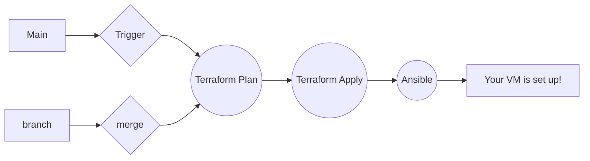

# DevOps Challeng

Olá! Esse repositório aqui contêm diversos exemplos de processos devops! A implementação compete a uma máquina virtual com um container Wordpress rodando no Azure Cloud. A configuração é garantida pela implementação IAC em Terraform e Ansible. Para permitir a confiabilidade e avaliabilidade das informações de código foi implementado um workflow em GitHub Actions

# Files

Na pasta /.github/workflows você encontra um yaml que define os processos de deploy do terraform e ansible.
O diretórios ansible e terraforms compõe as estruturas de configuração da infraestrutura. A pasta ansible contêm os arquivos de configuração hosts.yaml e playbook.yml. Dentro do diretório terraform encontram-se as duas estruturas báscias main e vars para a implementação da infraestrutura.
Em /wordpress você encontra um arquivo de configuração docker-compose para subir um container wordpress e um banco de dados mysql.

## Como colocar em ação?

Faça uma fork desse projeto e configure as seguintes variáveis em um ambiente Dev na sessão environments do github actions:
|Azure Cloud                       |O que é                         |
|-------------------------------|-----------------------------|
|`CLIENTID`             |O seu ID de cliente Azure          |
`CLIENTSECRET`           |O seu secret de cliente Azure                 |
|`SUBSCRIPTIONID`|O seu ID de subscripstion Azure     |
|`TENANTID`|O seu ID de tenant Azure     |

Para garrantir acesso ao infracost:
|INFRACOST                       |O que é                         |
|-------------------------------|-----------------------------|
|`INFRACOST_API_KEY`             |A sua key obtida na sua conta infracost          |

Para garrantir acesso ao github packges:
|GitHub|O que é                         |
|-------------------------------|-----------------------------|
| `YOUR_GITHUB_TOKEN` |          O seu token obtido nas configurações do github developer options 

Depois disso é so acionar a pipeline na sessão actions e rodar a partir main ou qualquer branch que você tenha configurado. Além disso, você pode fazer qualquer mudança em uma branch específica e ao mergear o código na main ele será implementado automaticamente.

## O Processo de Workflow

Esse é um exemplo de como funciona o processo workflow do projeto:

